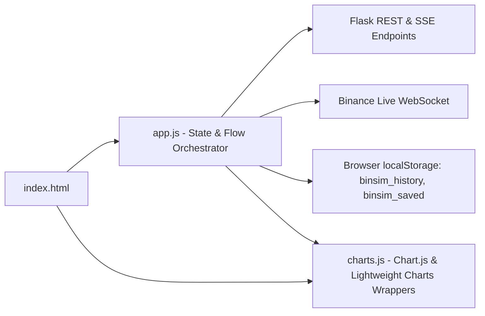

# Exhaustive Frontend Architecture Survey & Preservation Inventory
**Binary Options Quantitative Terminal UI/UX Redesign**

---

## 1. Executive Summary & File Structure

This document provides a comprehensive, component-by-component survey of the existing frontend codebase for the Binary Options Quantitative Terminal. The frontend operates as a single-page application (SPA) powered by Flask serving Jinja2 templates, styled with custom CSS (`style.css`), and driven by Vanilla JavaScript (`app.js` and `charts.js`) with Server-Sent Events (SSE) streaming, WebSockets, LocalStorage persistence, Chart.js, and TradingView Lightweight Charts v4.

### 1.1 File Index & Responsibilities

| File Path | Size | Primary Responsibility |
| :--- | :--- | :--- |
| `templates/index.html` | ~66.4 KB (846 lines) | Main UI markup containing header, mode switcher (Smart / Advanced), navigation tabs, control bars, chart containers, table structures, and progress console. |
| `static/css/style.css` | ~22.7 KB (1043 lines) | Design system variables (`:root`), glassmorphism card styling, responsive grid systems, console logs, ladder items, tooltips, and animations. |
| `static/js/app.js` | ~128.2 KB (2583 lines) | Core application orchestrator: state management, SSE streaming listeners, REST API calls, Binance WebSocket feeds, dynamic form rendering, Pine Script v5 & AI prompt generation, LocalStorage management, and event bindings. |
| `static/js/charts.js` | ~16.6 KB (470 lines) | Chart wrappers and rendering functions: TradingView Lightweight Charts setup, signal arrow markers, log/linear Y-axis formatters, Chart.js equity curves, Monte Carlo percentile cones, and custom Canvas 2D correlation heatmaps. |

### 1.2 Third-Party Library Imports & CDN Dependencies

| Dependency | CDN / Local Path | Purpose |
| :--- | :--- | :--- |
| **Google Fonts (Inter)** | `https://fonts.googleapis.com/css2?family=Inter:wght@300;400;500;600;700&display=swap` | Primary interface typography for body, headers, and form controls. |
| **TradingView Lightweight Charts v4** | `https://unpkg.com/lightweight-charts@4/dist/lightweight-charts.standalone.production.js` | High-performance interactive candlestick charts, price line overlays, and CALL/PUT/EXIT signal markers. |
| **Chart.js** | `https://cdn.jsdelivr.net/npm/chart.js` | Analytical charts: Equity Curves, Monte Carlo cones (P5, P25, P50, P75, P95), Autocorrelation lags, Streak distributions, Hourly win rates, and Market state comparisons. |
| **Favicons** | `/static/favicon.ico`, `/static/favicon.png` | Browser tab branding and icons. |

---

## 2. Complete DOM Element Catalog

### 2.1 Exhaustive HTML Element IDs Catalog

The following table catalogs every single HTML element with an explicit `id` across `templates/index.html` and its functional usage:

| ID | HTML Tag | CSS Classes | Section / Container | Functional Description & JS Binding |
| :--- | :--- | :--- | :--- | :--- |
| `mode-smart` | `<button>` | `mode-btn active` | Header | Toggles "Modo Inteligente (Piloto Automático)" view. |
| `mode-advanced` | `<button>` | `mode-btn` | Header | Toggles "Modo Avanzado (Manual)" view. |
| `btn-resultados` | `<button>` | `tab-btn` | Header (`.tabs-nav`) | Tab button to navigate to the Results / History panel. |
| `btn-estadisticas` | `<button>` | `tab-btn` | Header (`.tabs-nav`) | Tab button for deep quant statistics (initially disabled until backtest runs). |
| `btn-optimizador` | `<button>` | `tab-btn` | Header (`.tabs-nav`) | Tab button for the Barbell Streak Planner (initially disabled until backtest runs). |
| `smart-dashboard` | `<section>` | `tab-pane active` | Main Content | Container pane for the primary Smart Dashboard view. |
| `btn-smart-run` | `<button>` | `btn-primary` | `smart-dashboard` | Primary execution button: Triggers `runSmartOptimization()`. |
| `smart-preset-select` | `<select>` | `form-control` | `smart-dashboard` | Preset selector (6 Balas de $33.33, 8 Balas de $25, 1 Bala de $200). Updates numeric inputs. |
| `smart-streak-length` | `<input>` | - | `smart-dashboard` | Target streak length $N$ (default: `3`, min: `1`, max: `15`). |
| `smart-base-capital` | `<input>` | - | `smart-dashboard` | Base capital to protect (default: `1000`, min: `10`). Auto-calculates risk capital. |
| `smart-profit-pct` | `<input>` | - | `smart-dashboard` | Monthly P2P Arbitrage profit yield % (default: `20`, min: `1`, max: `100`). |
| `smart-risk-capital` | `<input>` | `input-readonly` | `smart-dashboard` | Auto-calculated risk budget (Base $\times$ Profit%). Readonly. |
| `smart-attempts` | `<input>` | - | `smart-dashboard` | Number of attempts/bullets $X$ (default: `6`, min: `1`, max: `50`). |
| `smart-payout` | `<input>` | - | `smart-dashboard` | Broker payout ratio (default: `0.85`, min: `0.1`, max: `1.0`, step: `0.01`). |
| `smart-generations` | `<input>` | - | `smart-dashboard` | Genetic algorithm generations in Rust (default: `50`, min: `5`, max: `200`). |
| `smart-population` | `<input>` | - | `smart-dashboard` | Genetic algorithm population size (default: `150`, min: `10`, max: `500`). |
| `smart-console-box` | `<div>` | `smart-console-wrapper` | `smart-dashboard` | Collapsible cyberpunk console container for live optimization progress. |
| `smart-progress-bar-fill` | `<div>` | `smart-progress-bar-fill`| `smart-dashboard` | Shimmer/fill bar reflecting 0–100% optimization progress. |
| `smart-console-logs` | `<div>` | `console-body` | `smart-dashboard` | Terminal log output container for real-time SSE messages. |
| `smart-top-5-box` | `<div>` | `top-strategies-wrapper glass-card` | `smart-dashboard` | Container for top strategy ranking pills. |
| `smart-top-5-list` | `<div>` | - | `smart-dashboard` | Dynamic container populated with `.top-strat-pill` buttons. |
| `smart-rec-content` | `<div>` | `smart-rec-text` | `smart-dashboard` | Container for natural language explanation, Pine Script modal, and summary metrics. |
| `smart-ladder-content` | `<div>` | - | `smart-dashboard` | Container for step-by-step Paroli compound betting ladder. |
| `smart-correlation-canvas`| `<canvas>` | - | `smart-dashboard` | HTML5 2D Canvas rendering the cross-asset correlation matrix heatmap. |
| `smart-selected-assets-table`| `<table>` | `markov-table` | `smart-dashboard` | Table showing low-correlation assets (<0.40) and their Out-Of-Sample win rates. |
| `smart-selected-assets-body` | `<tbody>` | - | `smart-dashboard` | Dynamic body for selected assets table. |
| `smart-equity-chart-canvas` | `<canvas>` | - | `smart-dashboard` | Chart.js canvas for the Smart Mode Barbell Equity Curve. |
| `smart-mc-chart-canvas` | `<canvas>` | - | `smart-dashboard` | Chart.js canvas for Monte Carlo percentile cones (1,000 paths). |
| `smart-asset-selector` | `<select>` | - | `smart-dashboard` | Asset dropdown to switch candle chart view between analyzed assets. |
| `smart-tv-chart` | `<div>` | `chart-container` | `smart-dashboard` | Lightweight Charts container for Japanese candlesticks and trade markers. |
| `smart-tv-chart-empty` | `<div>` | - | `smart-dashboard` | Overlay displayed when no price data is yet loaded. |
| `smart-markov-table` | `<table>` | `markov-table` | `smart-dashboard` | Table displaying Markov conditional transition probabilities ($P(W\|W)$, $P(L\|W)$). |
| `smart-markov-explanation`| `<div>` | - | `smart-dashboard` | Explanatory note container below Markov table. |
| `dashboard` | `<section>` | `tab-pane` | Main Content | Manual market exploration tab container. |
| `pair-selector` | `<select>` | - | `dashboard` & `backtest` | Dropdown for selecting currency/crypto pair (e.g., `BTCUSDT`, `WTI`). |
| `interval-selector` | `<select>` | - | `dashboard` & `backtest` | Dropdown for timeframe (`1d`, `4h`, `1h`, `30m`, `15m`, `5m`, `1m`). |
| `live-badge` | `<span>` | `live-badge-span` | `dashboard` | Pulsing badge indicating live Binance WebSocket / Polling status. |
| `live-badge-text` | `<span>` | - | `dashboard` | Text element inside live badge (shows live price or status). |
| `source-selector` | `<select>` | - | `dashboard` | Data source selector (`historical` vs `live`). |
| `tv-chart` | `<div>` | `chart-container glass-card`| `dashboard` | Manual TradingView candlestick chart container. |
| `chart-loader` | `<div>` | `loading-spinner` | `dashboard` | Animated spinner shown while fetching candle history. |
| `backtest` | `<section>` | `tab-pane` | Main Content | Manual Backtest execution tab container. |
| `run-backtest-btn` | `<button>` | `btn-primary` | `backtest` | Submits `#backtest-form` to execute backtest stream. |
| `save-backtest-btn` | `<button>` | `btn-secondary` | `backtest` | Saves current backtest configuration and results to Favorites (`localStorage`). |
| `backtest-form` | `<form>` | - | `backtest` | Main manual backtest configuration form. |
| `sec-strategy` | `<div>` | `subtab-pane active` | `backtest` | Subtab pane for Strategy and Indicator parameters. |
| `strategy-selector` | `<select>` | - | `backtest` | Strategy selector (loads strategies from `/api/strategies`). |
| `dynamic-params` | `<div>` | `dynamic-params` | `backtest` | Dynamically populated inputs for strategy hyperparameters (`param-${p.name}`). |
| `expiry-candles` | `<input>` | - | `backtest` | Binary option expiry length in candles (default: `1`, min: `1`). |
| `payout` | `<input>` | - | `backtest` | Broker payout ratio % (default: `0.92`, min: `0.1`, step: `0.01`). |
| `sec-barbell` | `<div>` | `subtab-pane` | `backtest` | Subtab pane for Barbell capital management parameters. |
| `group-n-consecutive` | `<div>` | `control-group` | `backtest` | Control group wrapper for streak target input. |
| `backtest-n-consecutive` | `<input>` | - | `backtest` | Consecutive wins target $N$ (default: `4`, min: `1`, max: `15`). |
| `backtest-cycle-prob` | `<small>` | `info-text` | `backtest` | Dynamic label showing calculated single-cycle success probability ($WR^N$). |
| `backtest-bet-fraction` | `<input>` | - | `backtest` | Initial bet fraction of risk capital (default: `0.10`, min: `0.01`, max: `1.0`). |
| `sec-genetic` | `<div>` | `subtab-pane` | `backtest` | Subtab pane for Rust Genetic Optimization controls. |
| `gen-generations` | `<input>` | - | `backtest` | Genetic generations (default: `50`, min: `5`, max: `200`). |
| `gen-population` | `<input>` | - | `backtest` | Genetic population size (default: `150`, min: `10`, max: `500`). |
| `gen-min-trades` | `<input>` | - | `backtest` | Minimum trades per day threshold (default: `5.0`, min: `0.5`, step: `0.5`). |
| `optimize-genetic-btn` | `<button>` | `btn-secondary` | `backtest` | Triggers Rust Genetic Optimizer via `/api/genetic/run-stream`. |
| `genetic-progress-container`| `<div>` | `progress-container` | `backtest` | Progress container for genetic optimization. |
| `genetic-progress-fill` | `<div>` | `progress-bar-fill` | `backtest` | Progress bar fill element for genetic optimization. |
| `genetic-progress-text` | `<span>` | - | `backtest` | Text display of genetic progress percentage. |
| `genetic-progress-eta` | `<span>` | - | `backtest` | Estimated time remaining (ETA) for genetic optimization. |
| `genetic-feedback` | `<div>` | - | `backtest` | Feedback summary box displaying OOS Win Rate, IS Win Rate, and Neighbor Stability. |
| `backtest-progress-container`| `<div>` | `progress-container` | `backtest` | Progress container for manual backtest. |
| `backtest-progress-fill`| `<div>` | `progress-bar-fill` | `backtest` | Progress bar fill element for manual backtest. |
| `backtest-progress-text`| `<span>` | - | `backtest` | Text display of manual backtest percentage. |
| `backtest-progress-eta` | `<span>` | - | `backtest` | ETA for manual backtest. |
| `quick-stats` | `<div>` | `stats-cards` | `backtest` | Container for quick metric summary cards. |
| `stat-winrate` | `<p>` | - | `backtest` | Displays Backtest Win Rate percentage. |
| `stat-trades` | `<p>` | - | `backtest` | Displays total trades simulated. |
| `stat-pnl` | `<p>` | - | `backtest` | Displays Net P&L (colored green/red). |
| `stat-mw` | `<p>` | - | `backtest` | Displays Maximum Consecutive Win Streak. |
| `stat-ml` | `<p>` | - | `backtest` | Displays Maximum Consecutive Loss Streak. |
| `equity-chart` | `<canvas>` | - | `backtest` | Chart.js canvas for manual backtest equity curve. |
| `trades-table` | `<table>` | `trades-table` | `backtest` | Table listing individual simulated trades with interactive row clicks. |
| `resultados` | `<section>` | `tab-pane` | Main Content | Tab container for backtest history and saved favorites. |
| `btn-clear-history` | `<button>` | `btn-secondary` | `resultados` | Clears all automatic optimization history from `localStorage`. |
| `history-list` | `<div>` | `backtest-list` | `resultados` | Container populated with historical optimization backtests. |
| `saved-list` | `<div>` | `backtest-list` | `resultados` | Container populated with favorited/bookmarked backtests. |
| `estadisticas` | `<section>` | `tab-pane` | Main Content | Deep quantitative statistical telemetry pane. |
| `autocorr-chart` | `<canvas>` | - | `estadisticas` | Chart.js bar chart for Autocorrelation Lags 1–10. |
| `streaks-chart` | `<canvas>` | - | `estadisticas` | Chart.js bar chart for streak length frequency distributions. |
| `hourly-chart` | `<canvas>` | - | `estadisticas` | Chart.js bar chart for hourly win rate profile. |
| `cond-probs` | `<div>` | `cond-probs-grid` | `estadisticas` | $2 \times 2$ grid displaying $P(W\|W), P(W\|L), P(L\|W), P(L\|L)$. |
| `market-state-chart` | `<canvas>` | - | `estadisticas` | Chart.js bar chart for Volatility / Trend market regime performance. |
| `markov-table` | `<table>` | `markov-table` | `estadisticas` | Markov state transition matrix table. |
| `optimizador` | `<section>` | `tab-pane` | Main Content | Manual Streak Optimizer / Barbell Risk Allocation pane. |
| `opt-winrate` | `<input>` | - | `optimizador` | Historical strategy win rate % input (step: `0.01`). |
| `opt-payout` | `<input>` | - | `optimizador` | Broker payout ratio input (default: `0.85`, step: `0.01`). |
| `opt-base-capital` | `<input>` | - | `optimizador` | Base capital to preserve (default: `1000`, min: `10`). |
| `opt-profit-pct` | `<input>` | - | `optimizador` | P2P arbitrage profit yield % (default: `20`, min: `1`, max: `100`). |
| `opt-risk-capital` | `<input>` | - | `optimizador` | Auto-calculated risk capital budget (readonly). |
| `opt-target-capital` | `<input>` | - | `optimizador` | Net profit target (default: `1000`, min: `50`). |
| `opt-attempts` | `<input>` | - | `optimizador` | Number of attempts/cycles $X$ (default: `5`, min: `1`, max: `50`). |
| `btn-calc-streak` | `<button>` | `btn-primary` | `optimizador` | Triggers `/api/optimize-streak` computation. |
| `streak-progress-container` | `<div>` | `progress-container` | `optimizador` | Progress container for streak calculation. |
| `streak-progress-fill` | `<div>` | `progress-bar-fill` | `optimizador` | Progress fill bar for streak calculation. |
| `streak-progress-text` | `<span>` | - | `optimizador` | Streak calculation status text. |
| `streak-progress-eta` | `<span>` | - | `optimizador` | Streak calculation ETA indicator. |
| `streak-recommendation-content`| `<div>` | - | `optimizador` | Banner displaying recommended streak $N$ and expected metrics. |
| `bet-ladder-container` | `<div>` | - | `optimizador` | Step-by-step Paroli bet ladder container. |
| `streak-alternatives-table`| `<table>` | `n-table` | `optimizador` | Table comparing alternative streak lengths $N=1..10$. |
| `mc-chart` | `<canvas>` | - | `optimizador` | Chart.js canvas for Monte Carlo campaign simulations (5,000 paths). |

---

### 2.2 Complete Form Inputs & Controls Catalog

The application contains 37 static form controls plus dynamically injected parameters:

| Input Tag | ID | Name Attribute | Type | Default Value | Bounds / Step | Attributes / Flags |
| :--- | :--- | :--- | :--- | :--- | :--- | :--- |
| `<input>` | *(none)* | `smart-universe` | `checkbox` | `WTI` | - | `checked` |
| `<input>` | *(none)* | `smart-universe` | `checkbox` | `NASDAQ` | - | `checked` |
| `<input>` | *(none)* | `smart-universe` | `checkbox` | `GBPJPY` | - | `checked` |
| `<input>` | *(none)* | `smart-universe` | `checkbox` | `XAUUSD` | - | `checked` |
| `<input>` | *(none)* | `smart-universe` | `checkbox` | `DOGEUSDT` | - | `checked` |
| `<input>` | *(none)* | `smart-universe` | `checkbox` | `ADAUSDT` | - | `checked` |
| `<input>` | *(none)* | `smart-universe` | `checkbox` | `BTCUSDT` | - | `checked` |
| `<input>` | *(none)* | `smart-universe` | `checkbox` | `BNBUSDT` | - | `checked` |
| `<input>` | *(none)* | `smart-universe` | `checkbox` | `ETHUSDT` | - | *(unchecked)* |
| `<select>` | `smart-preset-select` | *(none)* | `select` | `preset_33_6` | Options: `preset_33_6`, `preset_25_8`, `preset_200_1` | - |
| `<input>` | `smart-streak-length` | *(none)* | `number` | `3` | `min="1"` `max="15"` | - |
| `<input>` | `smart-base-capital` | *(none)* | `number` | `1000` | `min="10"` | - |
| `<input>` | `smart-profit-pct` | *(none)* | `number` | `20` | `min="1"` `max="100"` | - |
| `<input>` | `smart-risk-capital` | *(none)* | `number` | `200` | - | `readonly`, `.input-readonly` |
| `<input>` | `smart-attempts` | *(none)* | `number` | `6` | `min="1"` `max="50"` | - |
| `<input>` | `smart-payout` | *(none)* | `number` | `0.85` | `min="0.1"` `max="1.0"` `step="0.01"` | - |
| `<input>` | `smart-generations` | *(none)* | `number` | `50` | `min="5"` `max="200"` | - |
| `<input>` | `smart-population` | *(none)* | `number` | `150` | `min="10"` `max="500"` | - |
| `<select>` | `smart-asset-selector` | *(none)* | `select` | *(dynamic)* | Dynamically populated with selected universe assets | - |
| `<select>` | `pair-selector` | *(none)* | `select` | `BTCUSDT` | Populated via `/api/data/pairs` | - |
| `<select>` | `interval-selector` | *(none)* | `select` | `30m` | Populated via `/api/data/pairs` (`1d`–`1m`) | - |
| `<select>` | `source-selector` | *(none)* | `select` | `historical`| Options: `historical`, `live` | - |
| `<select>` | `strategy-selector` | *(none)* | `select` | *(dynamic)* | Populated via `/api/strategies` | - |
| `<input>` | `expiry-candles` | *(none)* | `number` | `1` | `min="1"` | - |
| `<input>` | `payout` | *(none)* | `number` | `0.92` | `min="0.1"` `step="0.01"` | - |
| `<input>` | `backtest-n-consecutive` | *(none)* | `number` | `4` | `min="1"` `max="15"` | - |
| `<input>` | `backtest-bet-fraction` | *(none)* | `number` | `0.10` | `min="0.01"` `max="1.0"` `step="0.01"` | - |
| `<input>` | `gen-generations` | *(none)* | `number` | `50` | `min="5"` `max="200"` | - |
| `<input>` | `gen-population` | *(none)* | `number` | `150` | `min="10"` `max="500"` | - |
| `<input>` | `gen-min-trades` | *(none)* | `number` | `5.0` | `min="0.5"` `step="0.5"` | - |
| `<input>` | `opt-winrate` | *(none)* | `number` | `""` | `step="0.01"` | `placeholder="Ej. 65.5"` |
| `<input>` | `opt-payout` | *(none)* | `number` | `0.85` | `step="0.01"` | - |
| `<input>` | `opt-base-capital` | *(none)* | `number` | `1000` | `min="10"` | - |
| `<input>` | `opt-profit-pct` | *(none)* | `number` | `20` | `min="1"` `max="100"` | - |
| `<input>` | `opt-risk-capital` | *(none)* | `number` | `200` | - | `readonly` |
| `<input>` | `opt-target-capital` | *(none)* | `number` | `1000` | `min="50"` | - |
| `<input>` | `opt-attempts` | *(none)* | `number` | `5` | `min="1"` `max="50"` | - |
| `<input>` | `param-${p.name}` | *(none)* | `number` | `p.default` | `min="${p.min}"` `max="${p.max}"` `step="${p.step}"` | `data-param="${p.name}"`, `required` |

---

### 2.3 Complete Button & Interaction Catalog

| Button ID | CSS Classes | Data Attributes | Inner Text / Label | Bound Event / Handler |
| :--- | :--- | :--- | :--- | :--- |
| `mode-smart` | `mode-btn active` | `data-mode="smart"` | `⚡ Modo Inteligente (Piloto Automático)` | `click` ➔ switches view to `#smart-dashboard`, hides `.tabs-nav` |
| `mode-advanced`| `mode-btn` | `data-mode="advanced"` | `⚙️ Modo Avanzado (Manual)` | `click` ➔ switches view to `#dashboard`, shows `.tabs-nav` |
| *(none)* | `tab-btn` | `data-tab="dashboard"` | `Mercado` | `click` ➔ `switchTab('dashboard')` |
| *(none)* | `tab-btn` | `data-tab="backtest"` | `Backtest` | `click` ➔ `switchTab('backtest')` |
| `btn-resultados` | `tab-btn` | `data-tab="resultados"`| `Resultados` | `click` ➔ `switchTab('resultados')` |
| `btn-estadisticas` | `tab-btn` | `data-tab="estadisticas"`| `Estadísticas` | `click` ➔ `switchTab('estadisticas')` (enabled post-backtest) |
| `btn-optimizador` | `tab-btn` | `data-tab="optimizador"`| `Optimizador` | `click` ➔ `switchTab('optimizador')` (enabled post-backtest) |
| `btn-smart-run` | `btn-primary` | *(none)* | `⚡ Auto-Optimizar Estrategia` | `click` ➔ `runSmartOptimization()` |
| *(none)* | `subtab-btn active` | `data-subtab="sec-strategy"` | `🔵 Activo y Estrategia` | `click` ➔ reveals `#sec-strategy`, hides other subtabs |
| *(none)* | `subtab-btn` | `data-subtab="sec-barbell"` | `🟢 Gestión Barbell` | `click` ➔ reveals `#sec-barbell`, hides other subtabs |
| *(none)* | `subtab-btn` | `data-subtab="sec-genetic"` | `🟣 Búsqueda Genética (Rust)` | `click` ➔ reveals `#sec-genetic`, hides other subtabs |
| `run-backtest-btn` | `btn-primary` | *(none)* | `⚡ Ejecutar Backtest` | Form submit trigger for `#backtest-form` (`runBacktest()`) |
| `save-backtest-btn`| `btn-secondary` | *(none)* | `⭐ Favoritos` | `click` ➔ `saveCurrentBacktest()` |
| `optimize-genetic-btn` | `btn-secondary` | *(none)* | `🚀 Ejecutar Búsqueda Rust` | `click` ➔ `runGeneticOptimizer()` |
| `btn-clear-history`| `btn-secondary` | *(none)* | `Limpiar Historial` | `click` ➔ `clearHistory()` |
| `btn-calc-streak` | `btn-primary` | *(none)* | `Calcular Plan de Rachas` | `click` ➔ `runStreakPlanner()` |
| *(dynamic)* | `top-strat-pill` | `data-strat-idx="${idx}"` | `${rankBadge} ${strat.name}` | `click` ➔ `renderStrategyView(selectedStrat)` |
| *(dynamic)* | `btn-save-item` | `data-id="${item.id}"` | `⭐ Favorito` | `click` ➔ `saveBacktestById(id)` |
| *(dynamic)* | `btn-delete-item` | `data-id="${item.id}"` `data-type="${type}"` | `Eliminar` | `click` ➔ `deleteBacktestById(id, type)` |

---

## 3. JavaScript Architecture & State Management

### 3.1 Script Responsibilities



### 3.2 Global State & Variables

1. **`const API = '/api'`**: Base URL path for all backend endpoints.
2. **`const state = { ... }`**:
   - `currentTab`: String ID of currently active tab pane (`'smart-dashboard'`, `'dashboard'`, `'backtest'`, etc.).
   - `candles`: Array of clean candle objects (`{ time, open, high, low, close, volume, color, wickColor, borderColor }`).
   - `strategies`: Array of strategy metadata returned by `/api/strategies`.
   - `backtestResults`: Latest result payload from manual backtest.
   - `optimizerResults`: Latest result payload from streak optimizer.
   - `selectedStrategy`: String name of selected strategy.
   - `lastWinRate`: Numeric win rate (0.0–1.0) used for cycle probability calculation.
   - `currentBacktestData`: Active backtest snapshot object for saving to favorites.
   - `loadedBacktestId`: String ID of loaded historical item (`'bt_...'` or `'bt_smart_...'`).
3. **TradingView Chart Instances**:
   - `let mainChart, candleSeries`: Manual exploration chart.
   - `let smartChart, smartCandleSeries`: Smart Mode multi-asset candlestick chart.
   - `let activeChartPriceLines = []`: Tracks price line annotations for trade inspection.
4. **WebSocket & Live Streaming**:
   - `let liveWs`: Active WebSocket instance for `stream.binance.com`.
   - `let livePollTimer`: Fallback `setInterval` timer (3000ms) for polling live Binance klines.
5. **Chart.js Instance Registries**:
   - `window[canvasId + 'Inst']`: Automatically tracked and destroyed upon re-rendering (`smart-equity-chart-canvasInst`, `smart-mc-chart-canvasInst`, `equity-chartInst`, `autocorr-chartInst`, `streaks-chartInst`, `hourly-chartInst`, `market-state-chartInst`).
   - `window.gnChartInst`, `window.mcChartInst`, `window.kellyChartInst`.
6. **Global Window Helper Functions**:
   - `window.togglePineScriptModal(id)`: Toggles visibility of `#pinescript-box-${id}`.
   - `window.copyPineScript(id)`: Copies contents of `#pinescript-code-${id}` to clipboard.
   - `window.copyAIPrompt(id)`: Copies structured LLM prompt from `#ai-prompt-${id}` to clipboard.

### 3.3 Dynamic DOM Generation & Template Rendering

1. **Strategy Dynamic Parameters (`#dynamic-params`)**:
   - Rendered by `renderStrategyParams(strategyName)`.
   - Dynamically builds inputs with `id="param-${p.name}"` and `data-param="${p.name}"`.
2. **Smart Top 5 Strategy Ranking (`#smart-top-5-list`)**:
   - Rendered dynamically in `runSmartOptimization()`.
   - Builds `.top-strat-pill` elements displaying rank medals, win rates, and streak probabilities.
3. **Trades Table Rows (`#trades-table tbody`)**:
   - Rendered in `displayBacktestResults(data)`.
   - Rows contain `data-trade-idx="${idx}"`. Clicking a row invokes `highlightTradeOnChart(trade, chartObj, seriesObj)` to draw dashed/dotted entry and exit price lines.
4. **Historical & Saved Backtest Cards (`#history-list`, `#saved-list`)**:
   - Rendered by `renderResultsLists()`.
   - Generates `.backtest-item` cards with badges (`⚡ AUTO-OPTIMIZACIÓN GENÉTICA` or `⚙️ BACKTEST MANUAL`), metrics, and action buttons (`.btn-save-item`, `.btn-delete-item`).
5. **Universe Checkbox Badges (`.asset-wr-badge`)**:
   - Injected directly into the `<label>` of each asset checkbox after optimization to display star ratings and OOS win rates.

### 3.4 API & Data Communication Matrix

| Channel / Route | Protocol / Method | Parameters / Payload | Handled in `app.js` |
| :--- | :--- | :--- | :--- |
| `/api/data/pairs` | REST `GET` | *(none)* | `loadPairs()` |
| `/api/data/candles` | REST `GET` | `pair`, `interval`, `limit` | `loadCandles()`, `loadAssetCandles()` |
| `/api/strategies` | REST `GET` | *(none)* | `loadStrategies()` |
| `/api/backtest-stream` | SSE `GET` (`EventSource`) | `strategy`, `params` (JSON), `pair`, `interval`, `expiry_candles`, `payout`, `mode`, `n_consecutive`, `bet_fraction` | `runBacktest()` |
| `/api/genetic/run-stream` | SSE `GET` (`EventSource`) | `pair`, `interval`, `expiry`, `min_trades`, `generations`, `population` | `runGeneticOptimizer()` |
| `/api/smart-optimize-v2-stream`| SSE `GET` (`EventSource`)| `base_capital`, `profit_pct`, `attempts`, `payout`, `streak_length`, `generations`, `population`, `universe` (JSON) | `runSmartOptimization()` |
| `/api/optimize-streak` | REST `POST` (`fetch`) | `{ win_rate, payout, risk_capital, target_capital, attempts }` | `runStreakPlanner()` |
| `wss://stream.binance.com:9443` | WebSocket | `/ws/<pair>@kline_<interval>` | `connectLiveStream(pair, interval)` |

---

## 4. Existing Layout, CSS Structure & Redesign Gaps

### 4.1 Layout Hierarchy & CSS Analysis

1. **Root Containers**:
   - Canvas: `#090d16` with radial gradient overlays.
   - Panels: `.glass-card` using `rgba(17, 24, 39, 0.75)` with `backdrop-filter: blur(16px)` and 14px border radius.
2. **Current Spacing & Grid System**:
   - Headers: Fixed 68px height.
   - Smart Dashboard Grid: Vertical column layout (`.smart-grid`) with horizontal control bar at the top, followed by 4 sub-rows:
     - Row Top: Recommendation banner (1.5fr) + Bet Ladder (1fr).
     - Row Correlation: Heatmap (1.4fr) + Selected Assets Table (1fr).
     - Row Charts: Equity Curve (1fr) + Monte Carlo (1fr).
     - Row Bottom: Candlestick Chart (2fr) + Markov Matrix (1fr).
3. **Current Responsive Breakpoint**:
   - `@media (max-width: 1100px)`: Stacks all 2-column grid rows into single columns (`1fr !important`).

### 4.2 Identified UI/UX Gaps in Relation to `GUIA_MAESTRA_REDISENO_UI_UX_TERMINAL_PRO.md`

| Design Dimension | Current Implementation | Requirement in Master Guide (`GUIA_MAESTRA...`) |
| :--- | :--- | :--- |
| **Color Architecture** | Heterogeneous dark grays (`#090d16`, `#111827`, `#161b22`, `#010409`, `#0d1117`) with saturated pure neon accents (`#00f5a0`, `#39ff14`, `#ff4d4d`). | Strict layered palette: Canvas (`#080b11`), Base Surface (`#0e1420`), Elevated Surface (`#141d2e`), Hover Surface (`#1c273d`), Subtle Border (`rgba(255,255,255,0.07)`). |
| **Optical Ergonomics** | High contrast pure black `#000000`/`#010409` boxes with bright green text causing halation on OLED/IPS displays. | Calibrated APCA-compliant contrast using slate/obsidian backgrounds and softened text (`#f0f6fc`, `#94a3b8`, `#64748b`). Suppress chromostereopsis. |
| **Numerical Typography** | Standard proportional font rendering across tables and metrics. Digits shift horizontally upon dynamic updates. | Strict **Tabular Figures** (`JetBrains Mono` / `Geist Mono` with `font-variant-numeric: tabular-nums` and `font-feature-settings: "tnum" 1`). |
| **Geometry & Radius** | Inconsistent border radii (14px on glass cards, 24px on mode buttons, 4px on badges, 8px on inputs). | Consistent 8-point geometric hierarchy: Cards (`8px–10px`), Controls/Inputs (`6px`), Badges/Pills (`9999px`). |
| **Micro-Interactions** | Default linear transitions and unstyled progress bars. | Snappy hardware-accelerated transitions (150ms–220ms with `cubic-bezier(0.16, 1, 0.3, 1)`), shimmer animation on genetic progress bar. |

---

## 5. Critical Preservation Inventory (Zero-Regression Guarantee)

To guarantee that 100% of the backend logic, Rust genetic algorithms, SSE streaming, and chart rendering continue working with zero errors, the following elements **MUST REMAIN EXACTLY PRESERVED**:

### 5.1 Critical DOM Element IDs to Preserve

```
[Header & Navigation]
- mode-smart
- mode-advanced
- btn-resultados
- btn-estadisticas
- btn-optimizador

[Smart Dashboard Pane]
- smart-dashboard
- btn-smart-run
- smart-preset-select
- smart-streak-length
- smart-base-capital
- smart-profit-pct
- smart-risk-capital
- smart-attempts
- smart-payout
- smart-generations
- smart-population
- smart-console-box
- smart-progress-bar-fill
- smart-console-logs
- smart-top-5-box
- smart-top-5-list
- smart-rec-content
- smart-ladder-content
- smart-correlation-canvas
- smart-selected-assets-table
- smart-selected-assets-body
- smart-equity-chart-canvas
- smart-mc-chart-canvas
- smart-asset-selector
- smart-tv-chart
- smart-tv-chart-empty
- smart-markov-table
- smart-markov-explanation

[Manual Market & Candlestick Exploration]
- dashboard
- pair-selector
- interval-selector
- live-badge
- live-badge-text
- source-selector
- tv-chart
- chart-loader

[Manual Backtest Pane]
- backtest
- run-backtest-btn
- save-backtest-btn
- backtest-form
- sec-strategy
- strategy-selector
- dynamic-params
- expiry-candles
- payout
- sec-barbell
- group-n-consecutive
- backtest-n-consecutive
- backtest-cycle-prob
- backtest-bet-fraction
- sec-genetic
- gen-generations
- gen-population
- gen-min-trades
- optimize-genetic-btn
- genetic-progress-container
- genetic-progress-fill
- genetic-progress-text
- genetic-progress-eta
- genetic-feedback
- backtest-progress-container
- backtest-progress-fill
- backtest-progress-text
- backtest-progress-eta
- quick-stats
- stat-winrate
- stat-trades
- stat-pnl
- stat-mw
- stat-ml
- equity-chart
- trades-table

[Results & History Pane]
- resultados
- btn-clear-history
- history-list
- saved-list

[Deep Quant Statistics Pane]
- estadisticas
- autocorr-chart
- streaks-chart
- hourly-chart
- cond-probs
- market-state-chart
- markov-table

[Manual Barbell Streak Optimizer Pane]
- optimizador
- opt-winrate
- opt-payout
- opt-base-capital
- opt-profit-pct
- opt-risk-capital
- opt-target-capital
- opt-attempts
- btn-calc-streak
- streak-progress-container
- streak-progress-fill
- streak-progress-text
- streak-progress-eta
- streak-recommendation-content
- bet-ladder-container
- streak-alternatives-table
- mc-chart
```

### 5.2 Form Input Names & Data Attributes to Preserve

- Checkboxes: `name="smart-universe"` with values `WTI`, `NASDAQ`, `GBPJPY`, `XAUUSD`, `DOGEUSDT`, `ADAUSDT`, `BTCUSDT`, `BNBUSDT`, `ETHUSDT`.
- Mode Buttons: `data-mode="smart"`, `data-mode="advanced"`.
- Tab Buttons: `data-tab="dashboard"`, `data-tab="backtest"`, `data-tab="resultados"`, `data-tab="estadisticas"`, `data-tab="optimizador"`.
- Subtab Buttons: `data-subtab="sec-strategy"`, `data-subtab="sec-barbell"`, `data-subtab="sec-genetic"`.
- Strategy Dynamic Parameters: Inputs dynamically generated inside `#dynamic-params` with `data-param="${p.name}"` and `id="param-${p.name}"`.
- Trade Table Rows: `data-trade-idx="${idx}"` on `#trades-table tbody tr`.
- Top Strategy Pills: `data-strat-idx="${index}"` on `.top-strat-pill`.
- Backtest Item Cards: `data-id="${item.id}"`, `data-type="${type}"` on `.backtest-item`, `.btn-save-item`, `.btn-delete-item`.
- Global Modals: `pinescript-box-${id}`, `pinescript-code-${id}`, `ai-prompt-${id}` used by `window.togglePineScriptModal`, `window.copyPineScript`, `window.copyAIPrompt`.

---

## 6. Verification and Readiness Assessment

- All 89 static and dynamic DOM IDs have been cross-checked against JavaScript queries (`getElementById`, `querySelector`).
- All 37 form inputs and their bound events have been cataloged.
- SSE event handlers (`onmessage`, `onerror`, `type: 'log'`, `'progress'`, `'result'`, `'asset_winrates'`) and REST APIs are mapped.
- The redesign can proceed safely by preserving all IDs and attributes in the updated HTML markup while revamping CSS and visual aesthetics to institutional grade.
