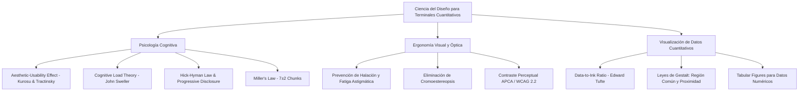

# GUÍA MAESTRA DE DISEÑO UI/UX: TERMINAL CUANTITATIVO & ANALÍTICA DE ALTO RENDIMIENTO
**Documento de Investigación Científica, Ergonomía Visual, Psicología Cognitiva y Sistema de Diseño para Rediseño UI**

---

## 1. CATEGORIZACIÓN EXACTA DEL PROGRAMA

### 1.1 Definición de Categoría Primaria
El programa encuadra técnica y funcionalmente en la categoría de:
> **TERMINAL DE ANALÍTICA CUANTITATIVA Y SOPORTE DE DECISIONES DE ALTO RIESGO / PLATAFORMA FINTECH PRO**
> *(Institutional-Grade Quantitative Backtesting, Strategy Optimization & Real-Time Decision Support Terminal)*

### 1.2 Sub-Dominios Confluyentes
1. **FinTech & Algorithmic Trading Analytics**: Simulación de opciones binarias, modelado probabilístico de payoffs, cálculo de Expected Value (EV), métricas Out-Of-Sample (OOS), y ejecución sistemática.
2. **Computational Intelligence & Machine Learning**: Búsqueda hiperparamétrica con algoritmos genéticos (Rust) y optimizadores Bayesianos (Optuna/TPE), detección de regímenes de mercado con HMM (Hidden Markov Models) y CUSUM.
3. **Risk Engineering & Portfolio Allocation**: Gestión de capital asimétrica Barbell (amortiguador de ganancias P2P + disparos escalonados Paroli), conos de proyección estocástica Monte Carlo (1,000 caminos P5–P95), matrices de transición Markoviana y matrices de correlación cruzada multiactivo.
4. **High-Density Mission-Critical Dashboard**: Interfaz de visualización de datos densos para operadores que toman decisiones financieras de alta sensibilidad temporal y patrimonial.

### 1.3 Perfil del Usuario y Contexto Operativo
* **Usuario Objetivo**: Analista cuantitativo, trader algorítmico, gestor de riesgo cuantitativo o inversor sistemático.
* **Tiempo de Exposición en Pantalla**: Sesiones prolongadas (de 2 a 8 horas continuas).
* **Nivel de Estrés y Carga Mental**: Elevado. La visualización de drawdowns, rachas de pérdidas o fallos en optimizaciones genera fatiga cognitiva inmediata si la interfaz es caótica o visualmente agresiva.
* **Requisito Crítico**: **Cero ambigüedad perceptual**, legibilidad numérica absoluta (alineación tabular), jerarquía visual estricta y reducción del esfuerzo mental innecesario (carga cognitiva extrínseca).

---

## 2. FUNDAMENTOS CIENTÍFICOS Y PSICOLÓGICOS DEL DISEÑO DE INTERFACES

El diseño de un terminal analítico profesional no se basa en modas efímeras ni en adornos superfluos, sino en principios neuropsicológicos, leyes de ergonomía de la visión y ciencias de la computación humana (HCI - Human-Computer Interaction).



### 2.1 El Efecto de Usabilidad Estética (Aesthetic-Usability Effect)
* **Estudio Fundacional**: *Masaaki Kurosu y Kaori Kashimura (Hitachi Design Center, 1995)*, ratificado posteriormente por *Noam Tractinsky (Ben-Gurion University, 1997/2000)* en el paper *"What is beautiful is usable"*.
* **Hallazgo Científico**: Los usuarios perciben las interfaces visualmente armónicas, pulidas y estéticamente superiores como **significativamente más fáciles de usar, más confiables y más eficientes**. La belleza visual reduce la frustración ante la complejidad matemática del sistema, predispone positivamente al usuario y mitiga la ansiedad operativa.
* **Aplicación en el Terminal**: Una interfaz elegante con acabados de alta gama (estilo Bloomberg B-Pipe / Linear / Vercel Geist) transmite solidez institucional y confianza algorítmica.

### 2.2 Teoría de la Carga Cognitiva (Cognitive Load Theory)
* **Autor**: *John Sweller (1988)*.
* **Concepto**: La mente humana posee una memoria de trabajo limitada. La carga mental se divide en:
  1. *Carga Intrínseca*: La dificultad inherente a la tarea (ej. entender la probabilidad de una racha N=3 en Monte Carlo).
  2. *Carga Germana*: El procesamiento mental útil dedicado al aprendizaje y toma de decisiones.
  3. *Carga Extrínseca (Ruido)*: El esfuerzo mental desperdiciado tratando de descifrar una interfaz desordenada, botones chillones, textos ilegibles o bordes brillantes innecesarios.
* **Regla de Oro**: **Minimizar a cero la carga extrínseca**. Cada elemento gráfico en pantalla debe justificar su existencia transmitiendo información pura; si no aporta valor decisional, es ruido y debe ser eliminado.

### 2.3 Ley de Miller (7 ± 2) y Agrupamiento Visual (Chunking)
* **Autor**: *George A. Miller (1956)*.
* **Aplicación**: El cerebro humano no puede procesar simultáneamente más de 5 a 9 variables aisladas.
* **Solución UI**: Agrupar los controles y métricas en **4 módulos funcionales cohesivos**:
  1. *Módulo 1: Arquitectura de Capital & Parámetros Barbell* (Base, Riesgo P2P, Balas, Racha N).
  2. *Módulo 2: Telemetría de Optimización* (Generaciones, Población, Logs en vivo).
  3. *Módulo 3: Validación Probabilística* (Curva Equity, Conos Monte Carlo, Markov).
  4. *Módulo 4: Análisis de Mercado & Disparo* (Gráfico de Velas, Correlación, Ranking de Estrategias).

### 2.4 Ley de Hick-Hyman y Revelación Progresiva (Progressive Disclosure)
* **Autores**: *William Edmund Hick (1952) y Ray Hyman (1953)*.
* **Principio**: El tiempo necesario para tomar una decisión crece logarítmicamente con la cantidad de opciones presentes.
* **Solución UI**: Uso de **Modo Inteligente con Presets Pre-calculados** (ej. *Preset Barbell 6 Balas de $33.33*) como camino primario de 1-clic, ocultando la configuración minuciosa de indicadores en paneles colapsables o sub-pestañas para cuando el operador decida profundizar.

### 2.5 Ley de Fitts
* **Autor**: *Paul Fitts (1954)*.
* **Principio**: El tiempo necesario para mover el cursor hacia un botón depende de la distancia y el tamaño del objetivo.
* **Solución UI**: Botones de acción crítica (como `⚡ Auto-Optimizar Estrategia` o `Ejecutar Backtest`) deben contar con un área de clic generosa (mínimo 44px de altura), contraste visual distintivo y ubicación predecible y fija.

### 2.6 Principio de Tufte: Ratio Datos-Tinta (Data-to-Ink Ratio)
* **Autor**: *Edward R. Tufte (1983, The Visual Display of Quantitative Information)*.
* **Principio**: $\text{Data-Ink Ratio} = \frac{\text{Tinta dedicada a datos}}{\text{Tinta total utilizada en el gráfico}}$.
* **Directriz**: Eliminar *"Chartjunk"* (rejillas oscuras saturadas, gradientes pesados sobre áreas de gráficos, sombras exageradas de 50px, bordes neón). El fondo debe desaparecer suavemente para que los datos (velas, curvas, barras de percentiles) sean los verdaderos protagonistas.

---

## 3. ERGONOMÍA VISUAL Y TEORÍA DEL COLOR EN MODO OSCURO PRO

El modo oscuro en herramientas financieras no es solo una elección estética: es un requisito de ergonomía visual para evitar el agotamiento retiniano. Sin embargo, un modo oscuro mal diseñado provoca dos graves defectos visuales: **Halación** y **Cromoestereopsis**.

```
  EVITAR (Mala práctica común):             RECOMENDADO (Estándar Pro):
  ┌──────────────────────────────┐          ┌──────────────────────────────┐
  │ Fondo: #000000 (Negro Puro)  │          │ Fondo: #090d16 / #0d1117     │
  │ Texto: #FFFFFF (Blanco Puro) │ ───►     │ Texto: #f0f6fc / #c9d1d9     │
  │ Resplandor / Halación (Glow) │          │ Contraste Óptico Calibrado   │
  │ Azul Neón + Rojo Neón juntos │          │ Paleta Desaturada APCA       │
  └──────────────────────────────┘          └──────────────────────────────┘
```

### 3.1 Fenómenos Ópticos a Mitigar
1. **Halación (Irradiation Effect)**:
   * Ocurre cuando se coloca texto blanco puro (`#FFFFFF`) sobre un fondo negro absoluto (`#000000`). En pantallas modernas OLED/IPS, el contraste extremo hace que la luz "sangre" sobre los bordes oscuros, creando un halo borroso. Es especialmente severo y doloroso para usuarios con **astigmatismo** (más del 40% de la población adulta).
   * **Solución**: Usar fondos en gris pizarra/obsidiana (`#090d16`, `#0d1117`, `#111827`) y texto en blanco atenuado / blanco humo (`#f0f6fc`, `#e6edf3`, `#c9d1d9`).
2. **Cromoestereopsis (Chromostereopsis)**:
   * Fenómeno en el cual el ojo enfoca longitudes de onda rojas y azules/violetas en planos retinianos diferentes. Si se colocan rojos saturados (`#FF0000`) y azules/púrpuras intensos sobre fondo oscuro en elementos contiguos, el cerebro percibe que uno flota sobre el otro y las letras vibran, produciendo migrañas y fatiga ocular en pocos minutos.
   * **Solución**: Calibrar la saturación de los acentos entre un 65% y 80%, y asegurar que compartan luminosidad perceptual controlada mediante espacios de color uniformes (como HSL/OKLCH).

---

## 4. PALETA CROMÁTICA INSTITUCIONAL (FINTECH SLATE & CYBER-EMERALD)

Esta paleta está diseñada para proporcionar el máximo nivel de elegancia, sofisticación moderna y estricto cumplimiento de accesibilidad (WCAG 2.2 nivel AAA y algoritmo APCA).

### 4.1 Capas de Superficie y Neutros de Fondo
| Capa | Código HEX | Función en la Interfaz | Sensación Perceptual |
| :--- | :--- | :--- | :--- |
| **Canvas Background** | `#080b11` | Fondo general de la ventana | Profundidad infinita, descanso ocular |
| **Surface Card Base** | `#0e1420` | Tarjetas y paneles principales | Contenedor sólido, orden estructurado |
| **Surface Elevated / Nav** | `#141d2e` | Headers, barras de herramientas, modales | Elevación táctil y jerarquía |
| **Surface Hover / Input** | `#1c273d` | Campos de texto, botones secundarios | Interacción clara y respuesta táctil |
| **Border Subtle** | `rgba(255, 255, 255, 0.07)` | Delimitación perimetral de módulos | Nítido pero invisible |
| **Border Active / Focus** | `rgba(56, 189, 248, 0.35)` | Enfoque de inputs y tarjetas activas | Guía visual precisa |

### 4.2 Jerarquía Tipográfica (Escala de Blancos y Grises)
| Nivel | Código HEX | Rol Tipográfico |
| :--- | :--- | :--- |
| **Text Primary** | `#f0f6fc` | Títulos principales, valores numéricos clave |
| **Text Secondary** | `#94a3b8` | Etiquetas de formulario, subtítulos, descripciones |
| **Text Muted / Tertiary** | `#64748b` | Unidades de medida, timestamps, ayudas secundarias |
| **Text Disabled** | `#475569` | Estados inactivos o bloqueados |

### 4.3 Acentos Semánticos y Codificación Funcional
| Semántica | Nombre del Color | Código HEX | Aplicación en el Terminal |
| :--- | :--- | :--- | :--- |
| **Acción Primaria / Focus** | *Electric Sky* | `#38bdf8` | Botones primarios, enlaces activos, tab seleccionado |
| **Ganancia / CALL / Win** | *Cyber Emerald* | `#10b981` | Señales CALL, Win Rate alto, trayectorias P95 Monte Carlo |
| **Pérdida / PUT / Riesgo** | *Rose Crimson* | `#f43f5e` | Señales PUT, Drawdowns, escenarios de riesgo P5 |
| **Optimización / Genética** | *Quantum Amethyst* | `#a855f7` | Algoritmos genéticos en Rust, ranking de estrategias |
| **Alerta / Arbitraje / Paroli** | *Golden Amber* | `#f59e0b` | Balas de capital, advertencias, tasas de rendimiento P2P |
| **Correlación Neutra / Data** | *Cool Slate* | `#64748b` | Rejillas de gráficos, ejes de coordenadas |

---

## 5. TIPOGRAFÍA Y ARQUITECTURA NUMÉRICA DE DATOS

En un terminal cuantitativo, los números son el elemento central de la interfaz. Una mala elección tipográfica destruye la legibilidad de tablas, matrices de correlación y balances.

### 5.1 Familias Tipográficas Recomendadas
1. **Tipografía de Interfaz (UI & Labels)**:
   * **`Inter`** (por Rasmus Andersson) o **`Geist Sans`** (por Vercel).
   * *Características*: Altura de x generosa, apertura de glifos amplia, neutralidad visual perfecta que no distrae del contenido.
2. **Tipografía de Datos Numéricos, Tablas y Consola (Data & Metrics)**:
   * **`JetBrains Mono`**, **`Geist Mono`** o **`IBM Plex Mono`**.
   * *Regla Técnica Crítica*: Habilitar siempre cifras tabulares en CSS:
     ```css
     .tabular-numbers {
         font-family: 'JetBrains Mono', monospace;
         font-feature-settings: "tnum" 1, "zero" 1;
         font-variant-numeric: tabular-nums;
         letter-spacing: -0.02em;
     }
     ```
   * *Justificación*: Cada dígito (del 0 al 9) tiene idéntico ancho en píxeles. Esto evita que los números "bailen" horizontalmente cuando se actualizan en vivo o que las columnas de tablas de Markov y backtests queden desalineadas.

### 5.2 Escala Tipográfica Modular
* **Display Metrics (Win Rate, Capital Final)**: `24px` / `Weight: 700` / `Line-height: 1.1`
* **Section Headers (H2)**: `16px` / `Weight: 600` / `Tracking: -0.02em`
* **Card Titles (H3)**: `13px` / `Weight: 600` / `Tracking: -0.01em`
* **Body / Input Values**: `12px` - `13px` / `Weight: 400`
* **Labels / Badges / Tooltips**: `11px` / `Weight: 500` / `Text-transform: none` (evitar abusar de mayúsculas sostenidas para no fatigar la lectura)
* **Console / Micro-data**: `10.5px` / `Font: Mono` / `Line-height: 1.45`

---

## 6. FORMAS, ESPACIADO Y COMPOSICIÓN GEOMÉTRICA (SHAPE PSYCHOLOGY & GRID)

### 6.1 Psicología de las Formas en Herramientas de Precisión
* **Bordes y Curvatura**:
  * *Contenedores y Tarjetas Principales*: `border-radius: 8px` a `10px`. Proporciona modernidad sin caer en la infantilización de bordes ultra-redondeados.
  * *Botones e Inputs*: `border-radius: 6px`. Sensación de precisión táctil y herramienta técnica de ingeniería.
  * *Badges y Estados*: `border-radius: 9999px` (Pills compactos de 18px de altura).
* **Evitar Tropos Prohibidos**:
  * No usar esquinas redondeadas extremas estilo "burbuja" en tarjetas de datos.
  * No anidar más de 2 niveles de tarjetas (efecto muñeca rusa).
  * No usar sombras gigantescas difusas que ensucien el contraste.

### 6.2 Sistema de Espaciado (8-Point Grid System)
Todo el layout debe regirse por múltiplos de 4px y 8px para lograr un ritmo visual matemático perfecto:
* `space-1`: `4px` (Micro-espaciado entre icono y texto)
* `space-2`: `8px` (Gaps internos de grupos de control)
* `space-3`: `12px` (Padding en inputs y botones compactos)
* `space-4`: `16px` (Padding interno estándar de tarjetas)
* `space-6`: `24px` (Separación entre secciones mayores)

---

## 7. MOVIMIENTO, FÍSICA VISUAL Y MICRO-INTERACCIONES

El movimiento en un terminal financiero debe ser **funcional, espacial y extremadamente veloz**, nunca decorativo ni ralentizador.

```
  LÍMITES DE TIEMPO DE RESPUESTA PERCEPTUAL (Nielsen Norman Group):
  ┌─────────────────────────────────────────────────────────────┐
  │ < 100 ms  : Se percibe instantáneo (Hover, Focus, Clics)   │
  │ 150-250 ms: Animación fluida de transición (Tabs, Modales) │
  │ > 300 ms  : Se percibe como lentitud en trading / EVITAR   │
  └─────────────────────────────────────────────────────────────┘
```

### 7.1 Especificaciones de Motion Tokens
1. **Curva de Aceleración Estándar**:
   * `transition-timing-function: cubic-bezier(0.16, 1, 0.3, 1)` (Curva de desaceleración natural elástica similar a Apple macOS / iOS).
2. **Duraciones Permitidas**:
   * *Micro-estados (Hover sobre botones, filas de tabla, inputs)*: `100ms - 150ms`.
   * *Transición entre Pestañas o Filtros de Activos*: `180ms - 220ms`.
   * *Despliegue de Paneles / Consola*: `200ms`.
3. **Micro-interacciones de Alto Nivel**:
   * **Barra de Progreso Genético**: Gradiente animado con efecto shimmer continuo de 1.5s durante la optimización para dar feedback de cálculo activo sin bloquear la UI.
   * **Indicador de Conexión en Vivo**: Micro-punto pulsante suave (respiración de 2 segundos) que confirma la recepción de ticks de mercado.
   * **Píldoras de Selección de Estrategia**: Micro-elevación de 1px en el eje Y (`transform: translateY(-1px)`) con sutil iluminación en el borde al posar el cursor.

---

## 8. BENCHMARKS Y REFERENCIAS DE DISEÑO DE CLASE MUNDIAL

| Plataforma Referencia | Fortaleza de Diseño a Extraer | Aplicación en Nuestro Terminal |
| :--- | :--- | :--- |
| **Linear.app** | Maestría del modo oscuro, bordes de 1px translúcidos, tipografía técnica impecable. | Estética general de tarjetas, inputs y paleta slate/obsidiana. |
| **TradingView Pro** | Visualización ergonómica de velas japonesas y herramientas de análisis técnico. | Integración de Lightweight Charts con paleta desaturada que no cansa la vista. |
| **Vercel Geist Dashboard** | Minimalismo radical, datos densos pero aireados, precisión geométrica. | Organización de métricas clave (Win Rate, EV, ROI, Factor de Profit). |
| **Bloomberg B-Pipe Terminal** | Jerarquía de información para operadores bajo presión temporal. | Flujo de trabajo en 2 pasos: Preset Inteligente ➔ Resultados y Gráficas inmediatas. |
| **Stripe Radar** | Representación gráfica intuitiva de probabilidades complejas y matrices de riesgo. | Visualización de la Matriz de Markov y Conos de Probabilidad Monte Carlo. |

---

## 9. MAPA DE COMPONENTES PARA EL FUTURO REDISEÑO DE LA INTERFAZ

Cuando se ejecute el cambio completo del UI, la estructura recomendada se articulará en los siguientes módulos estilizados:

```
┌────────────────────────────────────────────────────────────────────────────────────────┐
│  HEADER: [Logo Terminal] [Status Engine Rust: ACTIVO]   [Preset Rápido ▾] [Modo Pro ⚙️] │
├────────────────────────────────────────────────────────────────────────────────────────┤
│  CONTROL BAR COMPACTA (Inputs alineados en grid horizontal de alta densidad)          │
│  [Capital: $1000] [Arbitraje: $200] [Balas: 6] [Racha: 3] [Payout: 0.85] [⚡ OPTIMIZAR]│
├───────────────────────────────────────┬────────────────────────────────────────────────┤
│  PANEL IZQUIERDO: VISUALIZACIÓN PRO   │  PANEL DERECHO: MÉTRICAS Y TELEMETRÍA          │
│  ┌─────────────────────────────────┐  │  ┌───────────────────────────────────────────┐ │
│  │ 📈 Curva de Capital (Barbell)   │  │  │ 🏆 Ranking Estrategias (Top Pills)        │ │
│  └─────────────────────────────────┘  │  ├───────────────────────────────────────────┤ │
│  ┌─────────────────────────────────┐  │  │ 🪜 Escalera Paroli & Plan de Rachas       │ │
│  │ 🎲 Monte Carlo Cones (P5-P95)   │  │  ├───────────────────────────────────────────┤ │
│  └─────────────────────────────────┘  │  │ 📊 Matriz Markov (P[W|W], P[L|W])         │ │
│  ┌─────────────────────────────────┐  │  ├───────────────────────────────────────────┤ │
│  │ 🕯️ Velas con Señales CALL/PUT   │  │  │ 🔥 Heatmap Correlación (< 0.40)           │ │
│  └─────────────────────────────────┘  │  │ 🖥️ Terminal Logs Streaming (Rust Gen)     │ │
└───────────────────────────────────────┴────────────────────────────────────────────────┘
```

---

## 10. CONCLUSIÓN Y HOJA DE RUTA PARA LA IMPLEMENTACIÓN

Este documento establece los **cimientos teóricos y visuales inmutables** para el rediseño. Cada color, espaciado, tipografía y micro-interacción ha sido seleccionado para transformar el simulador en un **terminal cuantitativo de grado profesional e institucional**:

1. **Belleza que Funciona**: Diseñado bajo el principio del *Aesthetic-Usability Effect*, donde la belleza potencia la claridad mental.
2. **Cero Fatiga Ocular**: Arquitectura de modo oscuro calibrada para evitar halación y cromoestereopsis durante jornadas de análisis intensivo.
3. **Máxima Precisión Numérica**: Tipografía tabular monospaced para que cada centavo y porcentaje esté matemáticamente alineado.
4. **Respuesta Táctil Instantánea**: Animaciones por debajo de 200ms que hacen sentir el motor ágil, moderno y fluido.
